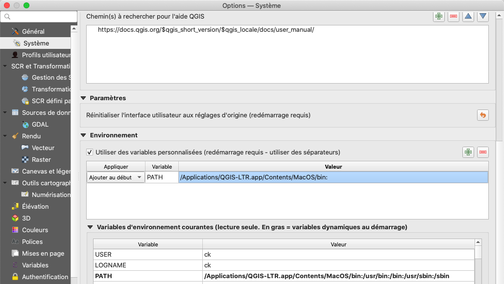

# Configurer PyQGIS sur macOS

Sur macOS, après une installation fraîche de QGIS, certaines commandes lancées depuis la console PyQGIS ne fonctionnent pas. Une de ces commande est `pip`, mais d'autres commandes affectées sont `ogr2ogr` ou `gdalinfo`. Nous allons résoudre le problème avec l'exemple `pip`, ceci va résoudre automatiquement le problème pour les autres commandes aussi.

Le message d'erreur que l'on obtient si vous êtes affectés par ce problème est quelque chose comme:

```
Command 'pip' not found
```

Cette erreur peut d'ailleurs se trouver à l'intérieur d'un message bien plus long et parfois un cryptique. L'erreur survient quand QGIS ne sait pas dans quel dossier la commande `pip` avait été installée. Il faut donc configurer QGIS en sorte à ce que le logiciel sache où chercher. Pour cela, il faut procéder de la manière suivante:

- Ouvrir QGIS, sélectionner le menu **«Préférences > Options...»**.

- Dans l'onglet **Système**, aller dans la section **Environnement**. Cocher l'option *«Utiliser des variables personnalisées»* si elle n'est pas déjà cochée. Ensuite, ajouter une nuovelle ligne en cliquant sur le bouton `+` à droite.

- Dans le menu «Appliquer», choisir *«Ajouter au début»*. Dans la colonne «Variable», saisir `PATH` (en majuscules), et sous valeur le contenu suivant (si vous avez installé la version LTR de QGIS):

    `/Applications/QGIS-LTR.app/Contents/MacOS/bin:`

   *Attention*: si vous avez installé la version non-LTR, le nom de QGIS dans le dossier `Applications` est différent. Il faut corriger le nom en conséquence (c'est donc le nom du logiciel comme écrit dans le Finder suivi de `.app`).

   Ça doit se présenter à la fin en gros comme dans la capture d'écran ci-dessous:

   

- Ensuite redémarrez QGIS pour appliquer les changements. Vous pouvez maintenant utiliser `pip` et installer le module `pooch` avec `!pip install pooch`. Vérifiez l'installation avec `import pooch`.
