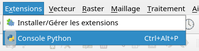
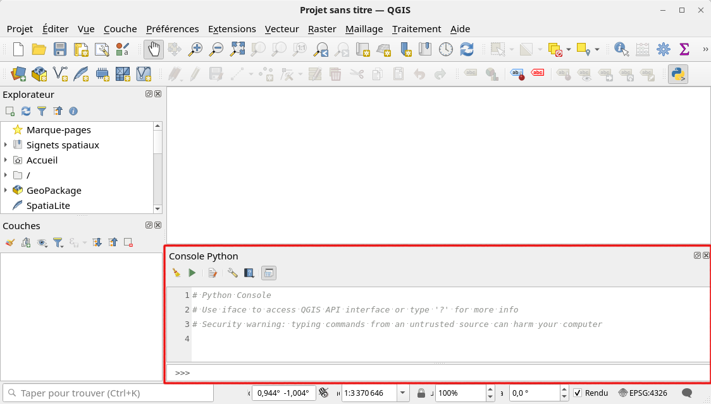
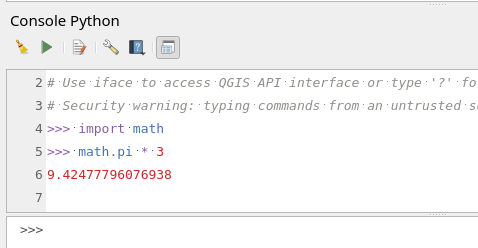
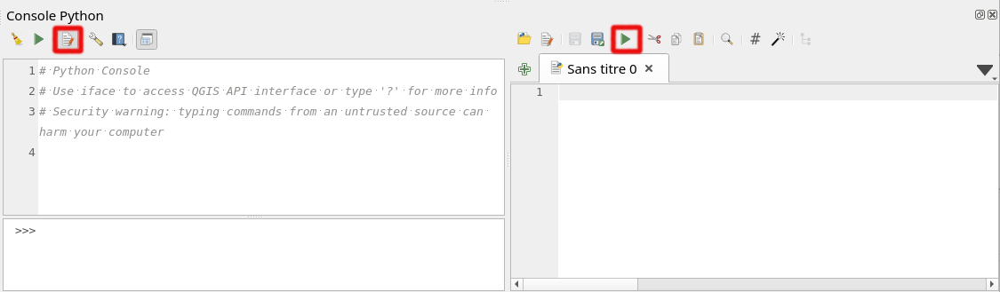
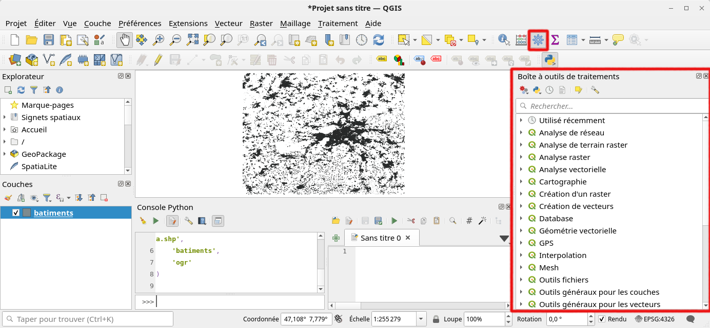
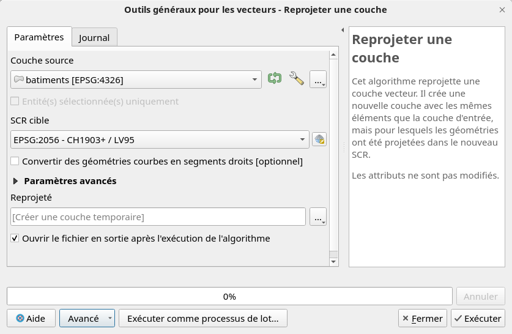
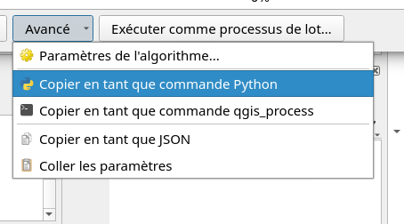

# Introduction à PyQGIS

QGIS, logiciel SIG open source écrit en C++, permet d’interagir avec Python. Cela offre plusieurs avantages :

- **Automatisation** : simplifiez des tâches répétitives via des scripts Python.
- **Transparence** : documentez chaque manipulation pour plus de traçabilité.
- **Extensibilité** : réalisez des analyses personnalisées grâce à des modules Python spécialisés.
- **Développement de plugins** : créez des plugins pour enrichir les fonctionnalités disponibles avec la possibilité de les partager avec la communauté QGIS.

Vous pouvez exécuter du code Python dans QGIS de trois manières :

1. Avec la **console Python** intégrée.
2. En exécutant un **script Python** dans QGIS ou en ligne de commande.
3. En créant un **plugin** Python pour QGIS.

## 1. La console Python

La console Python est intégrée dans QGIS. Elle peut être ouverte via le menu **Extension > Console Python** :



ou en cliquant sur le bouton avec l'icône Python dans la barre d'outils *Extensions*.

Par défaut, la console s'affiche en bas à droite de l'écran, mais elle peut être déplacée où vous le souhaitez :



La console fonctionne en mode **REPL** (Read, Execute, Print, Loop) : chaque commande entrée est lue et exécutée directement, et son résultat est affiché dans la console. Vous pouvez ensuite entrer une autre commande, formant ainsi une boucle continue.

La console permet d'exécuter n'importe quel code Python, même s'il n'est pas directement lié à QGIS. Par exemple, vous pouvez définir des variables ou effectuer des calculs classiques :



Si un module Python doit être installé, cela peut se faire avec l'outil de ligne de commande `pip`. La console QGIS supporte les commandes système en utilisant le préfixe `!`. Par exemple, pour installer le module `pooch` (utile pour télécharger des données), tapez :

```python
!pip install pooch
```

### Bug courant dans la console Python de QGIS

Il peut arriver que la commande `!pip install pooch` ne fonctionne pas dans la console Python de QGIS, car `pip` n'est parfois pas reconnu. Pour contourner ce problème, une solution consiste à créer un environnement Python séparé avec Anaconda/Miniconda et à le configurer pour QGIS. Voici les étapes :

1. **Installer Miniconda ou Anaconda**  
   Téléchargez et installez Miniconda (ou Anaconda) en suivant les instructions officielles : [Instructions pour l'installation de Miniconda](https://docs.anaconda.com/miniconda/miniconda-install/).

2. **Créer un environnement Python dédié pour QGIS**  
   Ouvrez une console `Anaconda Prompt` et créez un environnement pour QGIS en incluant les bibliothèques SIG nécessaires, comme `pooch`, `geopandas`, `shapely`, `fiona` et `rasterio` :
   ```bash
   conda create -n qgis_env python=3.9 pooch geopandas shapely fiona rasterio
   ```

3. **Pointer QGIS vers cet environnement**  
   Une fois l'environnement configuré, liez-le à QGIS en suivant ces quatre étapes :
   - 3.1. Allez dans **Préférences > Options > Système** dans QGIS.
   - 3.2. Dans la section **Environnement**, cochez "Utiliser des variables personnalisées".
   - 3.3. Cliquez sur le bouton vert "+" pour ajouter une nouvelle variable nommée `PYTHONPATH`.
     - Colonne **Appliquer** : sélectionnez "Écraser".
     - Colonne **Valeur** : entrez le chemin vers le dossier `site-packages` de l'environnement : `chemin/lib/python3.9/site-packages`, où `chemin` est le chemin copié de l'étape suivante.
   
   Pour trouver ce chemin :
   - Ouvrez une console Anaconda.
   - Activez l'environnement avec :
     ```bash
     conda activate qgis_env
     ```
   - Utilisez cette commande pour obtenir le chemin du dossier `site-packages` :
     ```bash
     python -c "import site; print(site.getsitepackages()[0])"
     ```

   N'oubliez pas la quatrième étape :
   
   - 3.4. **Ajouter le chemin au PATH** : Ajoutez une autre variable, nommée `PATH`, en sélectionnant "Écraser" dans **Mode Appliquer** et définissez la **Valeur** à `chemin/bin`, où `chemin` est le même que précédemment.

4. **Redémarrer QGIS**  
   Redémarrez QGIS pour appliquer les changements. Vous pouvez maintenant utiliser `pip` et installer des packages dans cet environnement. Vérifiez l'installation avec :
   - `import pooch` suivi de `print(pooch.__version__)`, qui doit afficher la version installée dans `qgis_env`.
   - `import pip` suivi de `print(pip.__version__)`, qui doit correspondre à la version installée dans `qgis_env`.


### Ajouter une couche vectorielle

L'objectif principal de la console Python est d'interagir avec QGIS. Toutes les actions disponibles dans l'interface graphique de QGIS peuvent également être effectuées via Python.

L'interface QGIS est accessible en Python grâce à la variable `iface`, qui est automatiquement définie au lancement de QGIS. Une méthode clé de cette interface est `addVectorLayer`, qui permet de charger une couche vectorielle. Il suffit de spécifier le chemin d'accès de la couche, le nom de la couche, et la méthode de chargement (la méthode correspond aux sources de données dans le gestionnaire).

Avant de charger une couche vectorielle, assurez-vous d'avoir téléchargé les données sur votre ordinateur. Cet exemple utilise les [GIS Starter Data](https://www.geoinformatique.ch/data/gis-starter-data), que vous devrez d'abord télécharger et placer dans un dossier accessible.

Pour charger une couche vectorielle, utilisez la commande `addVectorLayer`, en remplaçant le chemin d'accès (path) par l'emplacement où vous avez enregistré les données. Par exemple :

```python
lyr_osm_bati = iface.addVectorLayer(
    '/votre/chemin/vers/gis-starter-data/osm/greater-bern-extract/gis_osm_buildings_a.shp',
    'batiments',
    'ogr'
)
```

Dans cet exemple, remplacez `/votre/chemin/vers/gis-starter-data/...` par le chemin exact de votre fichier `.shp`. Ce code fonctionnera également avec d'autres jeux de données SIG, à condition d'indiquer le bon chemin.

Pour afficher les noms des attributs d'une couche, utilisez :

```python
for attr in lyr_osm_bati.fields():
    print(attr.name())
```

Pour ouvrir la table d'attributs dans QGIS :

```python
iface.showAttributeTable(lyr_osm_bati)
```

Dans cet exemple, la couche a un attribut `type` indiquant le type de bâtiment (selon les données OSM). Nous allons compter les bâtiments par type en extrayant la valeur de cet attribut pour chaque entité (`feature`). Pour cela, nous utilisons un dictionnaire spécial (`defaultdict`) qui initialise chaque nouvelle clé à 0 :

```python
from collections import defaultdict
```
``` python
# Initialiser le dictionnaire pour stocker le nombre de bâtiments par type
type_cnts = defaultdict(int)
```
```python
# Récupérer les entités de la couche
batiments = lyr_osm_bati.getFeatures()
```
```python
# Boucler sur chaque bâtiment pour compter les types
for bati in batiments:
    type_bati = bati['type'] or 'non défini'  # Définit 'non défini' si le type est vide
    type_cnts[type_bati] += 1
```
```python
# Afficher les nombres d'écoles et d'églises
print(f"Écoles : {type_cnts['school']}")
print(f"Églises : {type_cnts['church']}")
```

## 2. Scripts Python

Dans la console Python, chaque instruction doit être saisie une par une, ce qui est pratique pour tester rapidement des commandes. Cependant, pour exécuter plusieurs lignes de code, il est préférable d'utiliser des fichiers de script.

La console Python de QGIS intègre un éditeur de scripts. Cliquez sur le bouton correspondant pour ouvrir l'éditeur sur la droite :



Un script peut être enregistré sur le disque (sous l'extension `.py`) pour conserver une trace du code et le réutiliser plus tard. Pour exécuter le script actif dans l'éditeur, cliquez sur le bouton avec le triangle vert.

## 3. Outils de géotraitement

QGIS dispose de nombreux outils de géotraitement. La boîte à outils est accessible via **Traitement > Boîte à outils** ou depuis la barre d'outils :



Tous les outils fonctionnent de manière similaire : un double-clic ouvre une boîte de dialogue où vous pouvez paramétrer le traitement. Par exemple, voici comment projeter une couche de bâtiments OSM en coordonnées suisses (en créant une couche temporaire) :



Pour les scripts, le bouton « Avancé » en bas de la fenêtre est utile. Il fournit, entre autres, la commande Python correspondant au traitement paramétré. Une fois le géotraitement effectué avec succès, vous pouvez copier cette commande pour l'intégrer dans un script Python.



La commande générée peut être longue. Il est souvent conseillé de formater le code pour en faciliter la lecture et la compréhension. Un bouton dans l'éditeur de code permet d'ajuster automatiquement le format.

## Pour aller plus loin...

- [Documentation PyQGIS](https://qgis.org/pyqgis/master/index.html)
- [PyQGIS Cookbook](https://docs.qgis.org/3.40/en/docs/pyqgis_developer_cookbook/index.html)
- [PyQGIS 101: Introduction to QGIS Python programming for non-programmers](https://anitagraser.com/pyqgis-101-introduction-to-qgis-python-programming-for-non-programmers) par Anita Graser
