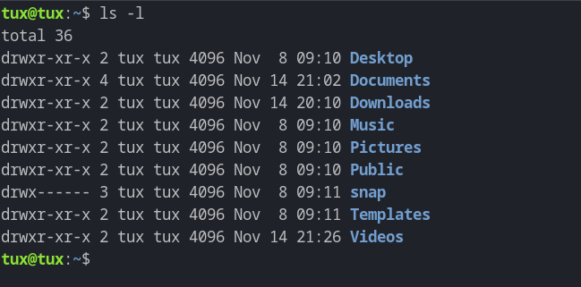
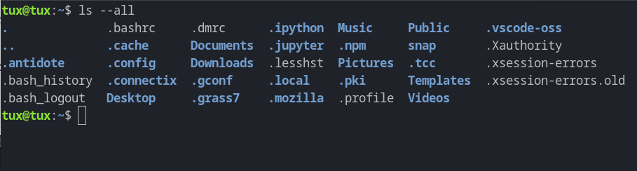

# Introduction aux logiciels de ligne de commande

Les logiciels de ligne de commande offrent une interface textuelle pour interagir avec un ordinateur. Ils sont aussi appelés logiciels «CLI» (pour Command-Line Interface). Contrairement aux interfaces graphiques (GUI), les logiciels CLI utilisent du texte pour définir les paramètres. Ce type d'interface est très utile pour automatiser des tâches.

Les logiciels de lignes de commande sont généralement exécutés depuis un «terminal» qui est une application qui permet d'interpréter les commandes textuelles, d'exécuter le logiciel correspondant et qui retourne le résultat textuel. Un terminal est parfois aussi appelé «console» ou «shell».

Mais les logiciels CLI peuvent aussi être exécutés par d'autres manières:

- Dans un environnement notebook (p.ex. sur Google Colab): une commande qui commence par un point d'exclamation est passée au système d'exploitation comme une commande CLI.

- Dans la console PyQGIS, le point d'exclamation au début d'une commande introduit également une commande CLI, comme dans un environnement notebook.

- Dans un script Python, il est possible d'utiliser un module spécial pour appeler un logiciel de ligne de commande.


## Principe de base

Tous les systèmes d'exploitation ont des logiciels de ligne de commande. Sur macOS, ceci se fait à travers l'application «Terminal» qui est disponible dans les utilitaires de système (dans le dossier «Applications > Utilitaires»). Sur Windows, PowerShell est une application similaire, mais il est aussi possible d'installer une console différente. Certains logiciels installent une telle console spéciale, dont aussi QGIS.

Le principe de base d'une commande de terminal est de taper le nom de la colonne, suivi parfois de paramètres ou d'options.

Chaque commande suit une syntaxe spécifique:

```bash
commande [options] [arguments]
```

**commande**: c'est le nom de l'outil ou logiciel que l'on souhaite exécuter. Par exemple la commande `ls` sous Linux ou macOS, ou la commande `dir` sous Windows permet de lister les fichiers d'un dossier.

**options**: les options ou *«flags»* permettent de modifier le comportement d'une commande. Elles commencent généralement par un tiret (`-`) suivi d'un caractère pour les *options courtes*. Par exemple, `ls -l` permet de faire une liste détaillée (*longue*) des fichiers d'un dossier:



Dans la capture d'écran ci-dessus, la commande est tout en haut, suivi de la sortie.

Une *option longue* commence avec deux tirets (`--`) suivi du nom de l'option. Par exemple la commande `ls --all` permet d'afficher tous les fichiers d'un dossier, y compris les fichiers cachés. Souvent, les logiciels CLI proposent certaines options fréquentes sous une forme courte ou longue. Ainsi `ls --all` et `ls -a` fait la même chose, `-a` est la variante courte de l'option `--all`:



Les options sont séparées par un espace de la commande. Pour définir plusieurs options, il suffit de les séparer par un espace, l'ordre n'est pas important. Ainsi, `ls -l --all` permet de faire une liste détaillée de tous les fichiers d'un dossier. Les options courtes peuvent aussi être combinées ensemble. Au lieu d'écrire `ls -a -l` (ce qui est correct et fonctionne bien), il est plus simple d'écrire `ls -al`. `ls -la` est la même chose.

En plus des *options simples*, il y a aussi des **options avec arguments**. Elles permettent de passer une valeur pour un certain paramètres. Ainsi, la commande `ls` contient p.ex. une option `--ignore` qui permet d'ignorer certains fichiers dans la liste de sortie. Par exemple, pour ignorer tous les fichiers qui commencent avec `D`, nous pouvons écrire:

```bash
ls -l --ignore=D*
```

(le caractère `*` permet dans ce cas d'indiquer au terminal qu'on veut omettre les autres caractères)

**arguments**: les arguments suivent après les options. Il s'agit de paramètres, comme p.ex. des noms de fichiers d'entrée ou de sortie. Dans le cas de la commande `ls`, le dossier pour lequel nous voulons savoir le contenu peut être ajouté à la fin, p.ex. `ls Documents`. Ceci permet de lister les fichier du dossier `Documents`.

Vous pouvez essayer ces commandes directement dans l'application Terminal sur votre Mac, ou sur Google Colab qui utilise un système Linux (la commande commence dans ce cas avec le point d'exclamation):

```bash
!ls -l
```

## Logiciels avec sous-commandes

Certaines commandes CLI sont très puissantes et permettent beaucoup de variantes. Ainsi, pour simplifier un peu, certains outils définissent des sous-commandes.

Par exemple la commande

```bash
pip install geopandas
```

n'est rien d'autre que la commande `pip` qui est un outil de ligne de commande, suivi d'une sous-commande `install` et suivi par un argument. L'outil `pip` est une commande qui permet de gérer les modules Python installés.

La commande

```bash
pip uninstall geopandas
```

est alors une autre sous-commande qui fait l'inverse de la précédente.

Ces commandes permettent évidemment aussi d'ajouter des options. Par exemple, si on veut s'assurer que la dernière version d'un module Python est installé, on peut faire

```bash
pip install --upgrade geopandas
```

ce qui est la même chose que

```bash
pip install -U geopandas
```

Dans ce cas, si `geopandas` n'est pas installé, le module est téléchargé. Si une version ancienne est installée, elle est remplacée par la version actuelle. Et si la version actuelle est déjà installé, la commande ne fait rien.


## Obtenir de l'aide

Il est évidemment impossible de connaître toutes les commandes, options et arguments par coeur. Il y a plusieurs façons pour obtenir de l'aide.

Une façon est de commencer par lancer la commande dans le terminal, p.ex. juste appeler:

```bash
pip
```

Une autre possibilité est de demander l'aide spécifiquement. Souvent, l'aide est accessible à l'aide d'une option `-h` ou `--help`, donc par exemple:

```bash
pip --help
```

En l'occurence, la sortie sera quelque chose comme:

```text
Usage:   
  pip <command> [options]

Commands:
  install                     Install packages.
  download                    Download packages.
  ...

General Options:
  -h, --help                  Show help.
  ...
```

expliquant les différentes sous-commandes disponibles ainsi que les différentes options.

La partie `Usage` est importante car elle donne la structure générale de la commande. Les parties entre parenthèses carrées sont optionnelles (donc p.ex. `[options]` indique que toutes les options sont optionnelles), les autres obligatoires.

On peut aussi demander l'aide pour une sous-commande spécifique, p.ex.

```bash
pip install --help
```

Finalement, dans certains cas, il y a des informations dans le *«manuel»* intégéré. Le manuel est accessible par la commande `man` suivi de la commande souhaitée, p.ex.

```bash
man ls
```

Ceci nous explique en détail la commande `ls`.
