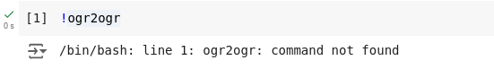
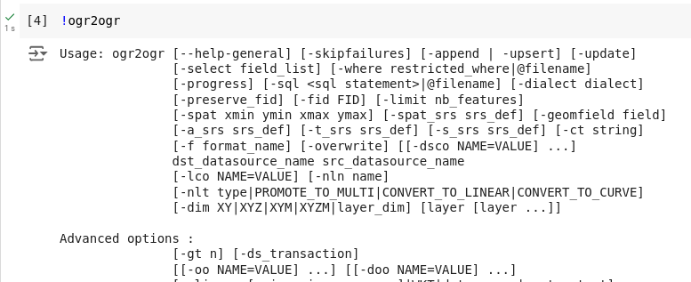
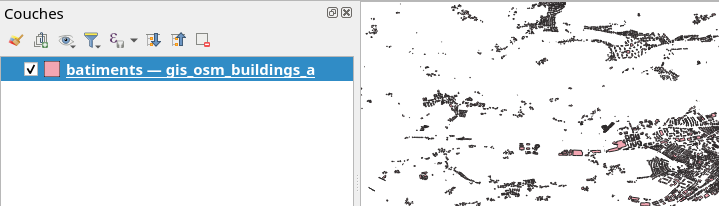

# L'outil ogr2ogr

QGIS vient avec de nombreux logiciels de ligne de commande qui sont très performants et souvent plus simples et rapides que les opérations dans l'interface graphique.

Pour certaines opérations dans l'interface graphique de QGIS, il y a aussi simplement un logiciel de ligne de commande qui est exécuté en arrière-plan.

L'outil que nous regardons ici est l'outil `ogr2ogr`.

OGR est une librairie de programmation qui permet de lire et écrire à peu près n'importe quel format de couche vectorielle. C'est la librairie qui est utilisée par QGIS pour lire et écrire toutes les couches vectorielles.

`ogr2ogr` (lire *«ogr-to-ogr»*) permet de lire une source OGR (une couche vectorielle) pour l'écrire dans une autre source OGR en appliquant des transformations.

L'outil `ogr2ogr` est disponible à travers la console Python dans QGIS, en appelant `!ogr2ogr` suivi des options et arguments.

Mais `ogr2ogr` peut aussi être utilisé sans QGIS, c'est un outil totalement indépendant. Il se peut qu'il est disponible directement dans le terminal de votre ordinateur, mais cela dépend essentiellement de la configuration.

Par contre, il est possible d'utiliser `ogr2ogr` avec Google Colab, même si ça ne marche pas par défaut:



Toutefois, Google Colab fonctionne avec un système Linux Ubuntu, et il est possible d'installer l'outil avec la commande suivante:

```bash
!apt install gdal-bin
```

et ensuite on peut lancer l'outil `ogr2ogr`:



`ogr2ogr` est un outil juste énorme. Il n'est pas aisé de voir à travers toutes les options possible. Pour cette raison, nous allons l'explorer pas à pas.

Nous pouvons aussi utiliser l'aide avec `ogr2ogr --help` ou `ogr2ogr --long-usage` pour une aide plus longue. Ou évidemment le site Web avec la documentation:

[https://gdal.org/en/latest/programs/ogr2ogr.html](https://gdal.org/en/latest/programs/ogr2ogr.html)

La difficulté est de faire abstraction de toutes les options qui ne sont pas nécessaires. Bien souvent, on va également faire des recherches sur le Web pour trouver d'avantage d'explications.


## Conversion de fichier simple

Si on enlève toutes les options de l'outil, la syntaxe devient assez simple:

```bash
ogr2ogr dst_datasource_name src_datasource_name
```

On a donc le nom de la commande, suivi de la source de données de **destination** (donc de sortie), suivi de la source de données d'entrée.

On peut donc faire quelque chose comme:

```bash
ogr2ogr batiments.gpkg gis_osm_buildings_a.shp
```

Ceci permet de lire un fichier Shape `gis_osm_buildings_a.shp` et de le convertir en fichier Geopackage `batiments.gpkg`. `ogr2ogr` devine le format par l'extension fournie. On peut aussi spécifier le format de manière explicite avec l'option `-f`. Pour un format Geopackage, ceci donne:

```bash
ogr2ogr -f GPKG batiments.gpkg gis_osm_buildings_a.shp
```

La liste des formats supportés peut être obtenue avec `ogr2ogr --formats`.

**Note**: comme tout outil de ligne de commande, les fichiers doivent être fournis avec le chemin d'accès complet. On peut utiliser l'outil `cd` pour changer le dossier de travail. Un chemin d'accès relatif au dossier de travail actuel peut être utilisé.

Un fichier Geopackage peut contenir plusieurs couches vectorielles, chacune avec un nom différent. Avec la commande ci-dessus, `ogr2ogr` a pris un nom par défaut pour la couche du Geopackage (le nom du fichier Shape). Dans QGIS, ceci donne:



«batiments» est le nom du fichier Geopackage, et «gis_osm_buildings_a» le nom de la couche.

On peut demander à `ogr2ogr` de donner un nom de couche spécifique à travers l'option `-nln` (pour `new layer name`, consultez `ogr2ogr --long-usage` pour plus de détails). Nous pouvons donc faire:

```bash
ogr2ogr -nln bati batiments.gpkg gis_osm_buildings_a.shp
```

Dans ce cas, la couche s'appelle `bati`.

**Attention**: la commande ci-dessus va **écraser** un fichier `batiments.gpkg` existant. Si un tel fichier existait avant, son contenu sera perdu. Dans le terminal, il n'y aura pas de dialogue du genre *«Ceci va écraser le fichier xyz. Est-ce que vous êtes vraiment certain·e de vouloir faire cela?»*. À la place, la commande sera simplement exécutée sans rien dire. Vous n'avez même pas de message qu'un fichier avec ce nom existe. Vérifiez donc vos commandes avant de les exécuter.

Même si `ogr2ogr` écrase un fichier existant par défaut, nous pouvons ajouter une deuxième couche à un Geopackage existant. Il faut juste dire à `ogr2ogr` que l'on veut mettre à jour un fichier existant avec l'option `-update`. Donc pour créer un Geopackage avec les bâtiments et les trains, on peut lancer deux commandes l'une après l'autre:

```bash
ogr2ogr -nln bati osm.gpkg gis_osm_buildings_a.shp
ogr2ogr -nln trains -update osm.gpkg gis_osm_railways.shp
```

(on a nommé le fichier Geopackage `osm.gpkg` au lieu de `batiments.gpkg`)


## Projeter une couche

`ogr2ogr` maitrise également les systèmes de coordonnées. L'option `-t_srs` permet de définir le sytème de coordonnées de sortie («target spatial reference system»), tout simplement en donnant le code EPSG:

```bash
ogr2ogr -nln bati -t_srs EPSG:2056 osm.gpkg gis_osm_buildings_a.shp
```

Le code EPSG 2056 correspond au système de coordonnées suisse MN95.


## Filtrer les entités selon l'étendue spatiale

`ogr2ogr` permet également d'appliquer des filtres à l'entrée. Ainsi, il est possible d'importer uniquement les entités spatiales qui se trouvent à l'intérieur d'une étendue spatiale donnée.

L'option pour limiter l'étendue spatiale est `-spat` qui prend 4 valeurs:

```
-spat <xmin> <ymin> <xmax> <ymax>
```

Si nous voulons par exemple ajouter les points d'intérêts du centre-ville de Berne depuis le fichier Shape OSM, nous pouvons faire la chose suivante:

```bash
ogr2ogr -update -nln pois -t_srs EPSG:2056 -spat 2600000 1199000 2601500 1200500 -spat_srs EPSG:2056 osm.gpkg gis_osm_pois.shp
```

En plus de l'option `-spat`, nous avons dû rajouter l'option `-spat_srs`, car sinon `ogr2ogr` ne sait pas si l'étendue fournie correspond au système de coordonnées d'entrée (WGS84) ou de sortie (MN95).

Nous avons déjà une commande assez longue ! Une commande longue devient vite difficile à lire. Nous pouvons l'écrire sur plusieurs lignes, mais nous devons terminer chaque ligne avec une barre oblique inversée:

```bash
ogr2ogr -update -nln pois -t_srs EPSG:2056 \
  -spat 2600000 1199000 2601500 1200500 \
  -spat_srs EPSG:2056 \
  osm.gpkg gis_osm_pois.shp
```

Les coordonnées de l'étendue peuvent être trouvées facilement dans QGIS.

L'option `-spat` ne fait qu'une sélection: les géométries qui intersectent avec l'étendue fournie sont maintenues, les autres écartées. Pour une couche vectorielle de points, ceci va bien, mais p.ex. une route pourrait sortir de l'étendue fournie. Pour changer cela, il faut procéder à un «clip». Dans ce cas, la partie de la géométrie qui dépasse l'étendue est coupée. L'option `-clipsrc` ou `-clipdst` permet de faire cela. `-clipsrc` fait cette opération sur le jeu de données d'entrée, `-clipdst` sur le jeu de données de sortie. Pour les routes, nous pourrions donc faire:

```bash
ogr2ogr -update -nln routes -t_srs EPSG:2056 \
  -clipdst 2600000 1199000 2601500 1200500 \
  osm.gpkg gis_osm_roads.shp
```

## Lire un fichier CSV

Un fichier CSV est un fichier texte qui contient des données tabulaires, similaire à un fichier Excel. Il peut contenir des données géographiques, typiquement avec une colonne pour les coordonnées x et une autre pour les coordonnées y.

Le fichier [appartements.csv](data/appartements.csv) est un exemple d'un tel fichier. Vous pouvez l'ouvrir avec un éditeur de texte comme Visual Studio Code, ou avec un tableur comme LibreOffice Calc.

Il contient entre autres une colonne `lat` et une colonne `lng` qui contiennent des coordonnées géographiques.

Nous pouvons le lire avec `ogr2ogr`, mais nous devons fournir trois informations:

- le nom de la colonne qui contient la valeur pour la coordonnée x
- le nom de la colonne qui contient la valeur pour la coordonnée y
- le système de coordonnées utilisé

Pour les noms des colonnes, ceci peut se faire à l'aide d'une option de lecture de fichier (une «open option») qui est indiquée avec l'option `-oo`. Le système de coordonnées est indiqué avec `-a_srs` («apply spatial reference system»). Nous avons donc quelque chose comme:

```bash
ogr2ogr -nln apparts \
  -oo X_POSSIBLE_NAMES=lng -oo Y_POSSIBLE_NAMES=lat \
  -a_srs EPSG:4326 \
  appartements.gpkg appartements.csv
```

Le code EPSG 4326 correspond au système de coordonnées WGS84.

Par défaut, `ogr2ogr` importe toutes les colonnes du fichier CSV. Nous pouvons limiter le choix avec l'option `-select` en indiquant les colonnes que nous souhaitons retenir dans la couche vectorielle de sortie. P.ex.

```bash
ogr2ogr -nln apparts \
  -oo X_POSSIBLE_NAMES=lng -oo Y_POSSIBLE_NAMES=lat \
  -a_srs EPSG:4326 \
  -select "adv_id,nombre_pieces,surface_habitable,loyer_mois" \
  appartements.gpkg appartements.csv
```

Nous pouvons ouvrir la couche de sortie dans QGIS. Si nous consultons la table d'attributs, nous constatons que tous les attributs sont présents, en plus d'un attribut `fid` ajouté automatiquement par `ogr2ogr`.